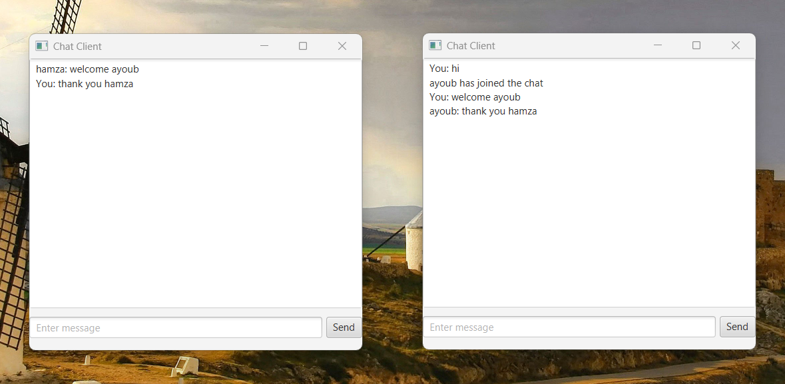
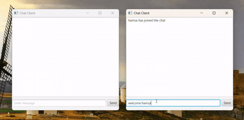

# JavaFX Chat Application

A simple real-time chat application built using **Java Sockets** and **JavaFX**. This project consists of:

- A **multithreaded chat server** that handles multiple clients.
- A **JavaFX-based chat client** for sending and receiving messages.

## 📌 Features

✔️ Real-time chat communication  
✔️ Multiple clients can join the chat  
✔️ Usernames are displayed in the chat  
✔️ JavaFX UI for better user experience  
✔️ Self-messages appear separately

## 📸 Screenshots

| Chat Window + Multiple Clients       |
|--------------------------------------|
|  |

## 🎥 Demo GIF

## 🛠️ Technologies Used

- **Java** (Socket Programming)
- **JavaFX** (GUI Framework)
- **FXML** (Layout for UI)

